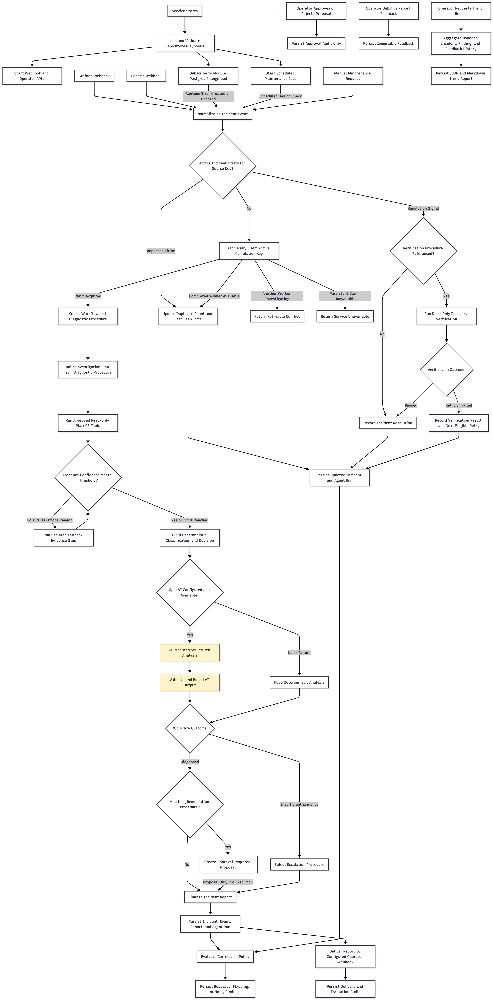

# Application Workflow

## Purpose

This document describes the implemented AI Support Agent runtime from service startup and incident triggers through investigation, report generation, persistence, delivery, verification, correlation, and operator interaction.

The current product is report-only. It can investigate, explain, propose, escalate, verify observed recovery, and identify operational patterns. It cannot execute remediation or mutate PlaceOS.

## Flow At A Glance

A new incident follows this path:

```text
signal -> normalized incident event -> lifecycle deduplication -> diagnostic plan
       -> read-only evidence collection -> confidence iteration
       -> deterministic decision -> optional AI analysis
       -> report, proposal, or escalation -> persistence and delivery
       -> verification, correlation, feedback, and trends
```

## Complete Runtime Workflow

[View on Mermaid Live](https://mermaid.live/edit#pako:eNqFV21zm0YQ_is35KuckZVYdtWZdjBCCQ0SKkjOuFUnc4aTdDW6Uw9wojj-79294wDJdpsPDoLbZ3effb1HJ5UZc0bOOpdf0y1VJVmMV4LAv2Thxos_V07C1ANPGUlK-FqsnL_I2dkvJIzcMXwMJc0IFRm5oTnPaMlIzPay4KVUBzLP6eFOynsUMpgopcXdeYDQCEk-s7stnNIw0Z4pCsJ44AUx76M7--BPfB91J9VdkSp-x0gpyVRmVc7IXBblRrGCeFsqNmzNWPYCShzNGu1JumUompEp5aJkggpw9jd5Z9Qb0Q-xO3FnLgh9UHRNBbVGWzpmUTx1w-APvz7vz_w48PA8E0zx9H_Ot37h1x8rJ65EyXeM-EoBGZ5iQG1G4HG5R5bBqR8tBqiZSbWDCHxnhBYkECnPmCiJ_wB_G__R7Rq-dfojo3m5BbpYen8EamSm7mzphqBgSkVF8yOOYvZPxYryBZeMbPPCJEww8b1bL_QfV46blvyBdez8xouyIGvwL5GVAuxP7PDrynmyUI2wpYftDSMTrrjYoOHj5TwMPHeBbBiSyLja5zzFJ08CnzrBQlpAzBkTZAH8trnxTEEh86rkUpCEbwTNUUXse9GNH9-CBzcQ1DVi44m5kinQqZCSNVMMyMmM9S9BzyRieaEbTMFUt5Q7wMnzA_Fyynek5saTSrHc4AMZbRBRrkayAv9UXJmUSPzQ90zR5iyF0pLqHitbuz7mdCOgPiAbG4tfxpW7fc6Q3s9cQPoS94HynN7l7Ijo54KukOUWzqNa-C8QD5AffANemBjF_iK-_RPZLSslgK1SHRAWvBVrCFX5ojlzpgrID0wU4_FS0K5By5l74wahex36LbbtWkdnm3q2kaw13LICgeBNMNH2VWgczc4iAXGJWSofGPSzbtAbS0-gTHRjP4nCG2NOKlXWpnqbWA2CUauLxDx-AfFluDhNs6gqU4k5-9SVqw9brmhRmFSoTXj9qGYfW8oE-DEy9TF3OQ4Wre1HRoD9VW5Kaca-QenmfMMxhBquQ7FJRe3VPHSx315XPM-6SYGlk1NB1kru_js7EUFDLaIoTOoIufu9gsBknVABXMqihCykzNvxoYVM549mk2DszzzsQv4DhiQ12Vc_ThmDRrTYwgjZyrxTxa1kE2hNQlDiwAJXCjBjB90ReZxGsV8bOWZpThV2KqjxO5rek0ZtUrJ9YyOKnJj4imJIVoxayHcc04liK9d16XtBEkQt02MoYbXjgmtSoXSKoo2jbggs5YXNRKPNgpghHQBLMJGFGxiONhV6gqJNR2gZgkNH1eQGX2BkhrdJgAGDrxDWrErB-qRUVVpqLBda6wGqu-GhQQF-69zUifCDTNwwvHa9TwD2ibH9iXsvADXqTWnBKBqb8dDsKujJNYyGDNVCee2rtgPZ81o4jpa231kzuu_rToA_gLGm6Z4WrD5QuxeIolpDNLiZ0yYl0E0_8dzQ2Fk3cb-A-XAyadr208GsS8jW_9QfB-4CgvmI47tMt9CFMUlZxk_Q2iB2pI6jOY-jeZToVcBsI3X50fwM9wAcQIgHux_Oyr9eQ7PtcR7p3XLChdlaOv1xL1UbBavWtrdaA8Fq_5lAjvjfWFq3U4trJC2PJk71B2sW_tIfkoUp1XrGNHb0zO7Uq-3pmaTfaAurtnVrcQ009sMA2idAjVkOA1zVkribdmqn2W_bffAUyYvi2K8zwAd-K7PAtOvAXMKobDeCWnPXiraFW79qow7aj05CuVXGO1PXqtZgk2A2DmYfkg6M3bt6ZJLT_R4SqodVOpO8OMAuJjJ4092bm11BAy7nWFBfTjmvV9o2B17muh5oz5COJpz2-5Uj3TfHTFtz3Tnk241O8vYiYqaM7rkx-xsKsugmen2bMXLPaLc1YnjWWdv4g9t-3c8aZXClga5e2NyZwPUFZ4bVY0We6Ql2u6rUm1RHpB5-sT8bw-T_fekni66uen2HaQcba9YWnpmzKKX79gauUxtMQd0oO2Hq2YCb4rCKyUcwSKrDsQFJi_qlqX5r_W8J9AfEmFJ1n8mv4tQkG58UZ1i3s_eaLk1558iYreEFWfM8H71Zr9fv07RXlEres9GbKzrM-v1eKnOpRm8Gd4OLft_pORvFM2cEg4n1nB3MFYo_nUcEXTmw1GIbH8FjBiaunJV4Apk9FX9IubNiSlabrTNa07yAX5XOamzJirZHwC2m9G3EGQ0HVz0HmjGwNTWXcH0X17jO6NH55ozOzvvv3v50efHT1WA4HPbPL4aDnnNwRudvL6-uzofn5xdXF8Pzy_7w4qnnfNe2vH87eHd1cTnov-8Ph4PL94OnfwHFzA-F)



The yellow nodes are the only steps currently performed by the language model. The surrounding investigation and workflow are deterministic, typed, and policy-controlled.

## 1. Service Startup

At startup, the service performs these operations before accepting incident work:

1. Load the complete repository playbook catalogue.
2. Validate schemas, stable procedure references, workflow transitions, terminal paths, tool allowlists, and category-specific constraints.
3. Start the HTTP API.
4. Start maintenance cron jobs when PlaceOS REST context is configured.
5. Configure shared Postgres persistence when database settings are present.
6. Start the PlaceOS module changefeed when Postgres is configured.

Startup loading is strict. An invalid initial catalogue prevents startup. After startup, the service fingerprints the playbook directories and atomically loads valid changes. An invalid live edit leaves the complete last-known-good catalogue active and exposes the reload error through service status.

When Postgres is not configured, the service can still process webhooks using in-memory stores. The module changefeed and durable history are unavailable in that mode.

## 2. What Starts Work

### Automatic and External Triggers

| Trigger                         | How it happens                                                                                                | Prerequisite                                           | Result                                                            |
| ------------------------------- | ------------------------------------------------------------------------------------------------------------- | ------------------------------------------------------ | ----------------------------------------------------------------- |
| Grafana webhook                 | An external Grafana integration sends `POST /api/ai-support/v1/webhooks/grafana`                              | The sender can reach and authenticate with the service | One normalized incident event                                     |
| Generic webhook                 | Another monitoring system sends `POST /api/ai-support/v1/webhooks/generic`                                    | The sender can reach and authenticate with the service | One normalized incident event                                     |
| Module runtime-error changefeed | `PlaceOS::Resource(PlaceOS::Model::Module)` observes a created or updated module with `has_runtime_error` set | Shared Postgres configuration                          | One module-state incident event                                   |
| Scheduled maintenance           | Tasker invokes a repository maintenance procedure according to its cron expression and time zone              | PlaceOS REST context is configured                     | One scheduled event per selected module and referenced diagnostic |
| Manual maintenance              | An operator sends `POST /api/ai-support/v1/maintenance/:id/runs`                                              | The maintenance procedure exists                       | The same flow as scheduled maintenance                            |
| Service desk ticket             | A service desk sends `POST /api/ai-support/v1/tickets` (normalised) or `POST /api/ai-support/v1/tickets/jira` (Jira webhook) | The sender holds the ticket webhook token when one is configured | One ticket incident event under `ticket:<reference>`              |

The runtime-error changefeed consumes module model changes already produced by the existing Triggers/Loki error scanner. The service does not currently subscribe directly to Redis module-state channels.

### Operator-Driven Follow-Up

These requests do not create a fresh diagnosis:

- Manual recovery verification
- Proposal approval or rejection
- Operator feedback
- Trend-report generation
- Reading incident, audit, delivery, escalation, maintenance, finding, or status data

## 3. Incident Event Normalization

Every source is converted into one typed incident event containing:

- Source
- Severity
- Source correlation key
- Original payload
- Tenant, system, and module scope when available
- Module name and index when available
- Firing or resolution lifecycle meaning

Webhook adapters translate source-specific JSON into this common contract. Scheduled maintenance constructs the same contract directly. Sensitive payload values are redacted before diagnostic selection, evidence storage, or AI analysis.

This shared event contract means reactive webhooks, PlaceOS-native runtime errors, and proactive maintenance all enter the same investigation workflow.

### Ticket Reading and Matching

A ticket carries prose, not ids. Before normalization the service:

1. Reads the ticket deterministically: PlaceOS ids (`mod-`, `sys-`, `zone-`, `driver-`), hostnames, integration and device names, room and building names, an environment (production, PPE, UAT, dev), error lines, a category and an urgency.
2. When OpenAI is configured, asks the model for the same fields as JSON and layers its answer over the deterministic one. A failed or unusable reply keeps the deterministic reading.
3. Matches names to PlaceOS records through the REST API: an authority by hostname, a system or module by id, otherwise a system by name search narrowed by any zone the ticket names, then a module by name search inside that system or across the instance.

One clear match sets the incident's tenant, system and module scope. Several equally good matches, or none, leave the scope blank and record every candidate and the reason, so the incident escalates with the reading attached. The ticket, the reading and the resolution travel in the event payload and appear in the report's inbound evidence.

## 4. Active Incident Lifecycle

Before running diagnostics, the service checks whether an active incident already has the same source correlation key.

### Repeated Firing

A repeated firing updates:

- Duplicate count
- Last-seen timestamp
- Event history
- Agent-run audit
- Correlation observations

It does not rerun the diagnostic workflow or redeliver the report.

### Resolution or Recovery Signal

For a correlated resolution signal:

- If the incident has no referenced verification procedure, the resolution is recorded directly.
- If a remediation proposal references a verification procedure, the service runs that read-only verification before considering the incident resolved.

### New Episode After Resolution

A later firing with the same source key creates a new incident episode. Historical correlation can then recognize recurrence across the distinct incident IDs.

### Cross-Worker Claiming

When persistence is enabled, a new incident must first acquire the active correlation key in Postgres. The service atomically inserts an `investigating` incident row or takes over the same row after an expired lease. The claim contains an opaque fencing token and database-timed expiry.

While the owner performs evidence collection and optional AI analysis, a heartbeat conditionally renews the lease using the incident ID and token. Final report persistence locks the incident row, verifies the same token, writes the incident, event, and report snapshot in one transaction, and clears the claim fields.

Another worker handling the same key:

- Returns the completed winner report when it becomes available and records the new signal as a duplicate.
- Returns `409 Conflict` with `Retry-After` while a valid owner is still investigating.
- Can take over an expired claim using the original incident ID.
- Never diagnoses or delivers a second incident while another valid claim exists.

If persistence is configured but claim acquisition is unavailable, the request returns `503 Service Unavailable` with `Retry-After`. It does not fall back to an uncoordinated in-memory incident. In-memory ingestion remains available only when persistence was not enabled in the first place.

Requests in the same process are also serialized per correlation key. Unrelated correlation keys continue concurrently.

## 5. Workflow and Diagnostic Selection

The default workflow starts at its diagnostic stage. It can select only diagnostic procedures explicitly referenced by that workflow.

For webhook and changefeed incidents, matching uses typed source, payload-pattern, and required-context rules. Maintenance supplies an exact diagnostic procedure reference, so a scheduled check cannot silently select a different diagnostic.

Adding a YAML diagnostic file does not activate it by itself. It must also be referenced by a workflow or maintenance procedure.

The diagnostics shipped in `playbooks/diagnostics` cover the device-level signatures (runtime error, HTTP 401/403, TLS, TCP timeout and refusal, device response timeout, SSH) and the shapes the service desk record shows most for modules and the platform: a driver setting missing from every level, a driver that no longer compiles, a sync module that stalled, a record present by id but absent from search, modules not loaded after a core restart, unhealthy pods, and API requests cut by an ingress timeout. The pod and ingress diagnostics are deliberately low-confidence so they escalate to a person with the cluster snapshot attached.

## 6. Investigation Planning

The selected diagnostic procedure creates a bounded investigation plan containing:

- Diagnostic goal
- Evidence targets
- Ordered read-only tool steps
- Step dependencies
- Required incident context
- I/O timeout per step
- Confidence threshold
- Maximum fallback iterations
- Procedure identity, version, and content hash

The plan is dynamic in the sense that the selected procedure, executable steps, skipped steps, fallback steps, and iteration count depend on the incident context and observed evidence. The language model does not currently invent this plan.

## 7. Read-Only Evidence Collection

The service executes only code-owned tools named by the selected procedure. Current evidence can include:

- Module details
- Module state
- Module runtime-error logs
- System details
- Collated module settings keys against the keys the driver declares (`module_settings`)
- Driver identity, commit, update state and compile result (`driver_details`)
- Every module in a system with its running, connected and error flags (`system_modules`)
- Whether a system found by id is also in the name search and zone listing (`search_consistency`)
- Core node load and the drivers and modules each node has loaded (`cluster_status`)
- REST API, core and platform versions (`platform_version`)
- Core loaded-process context exposed by REST API

PlaceOS access uses `PlaceOS/crystal-client`. REST API provides the authenticated boundary for module, system, and Core process evidence. Procedures cannot add arbitrary URLs, HTTP bodies, SQL, shell commands, or executable expressions.

Each tool execution records:

- Completed, skipped, or failed status
- A human-readable summary
- Evidence returned
- Failure evidence when access is unavailable

## 8. Confidence-Based Iteration

After the primary tool steps, the deterministic engine calculates confidence from:

- Procedure initial confidence
- Successfully completed evidence tools
- Tool failures
- Missing diagnostic context

When confidence is below the procedure threshold and iterations remain, the engine executes the next declared fallback evidence step. It recalculates confidence after each iteration.

The loop stops when:

- Confidence reaches the threshold
- The configured maximum iteration count is reached
- No eligible fallback step remains

The service then builds a deterministic classification and decision containing observed facts, hypotheses, ruled-out causes, escalation need, and operator guidance.

## 9. The Exact AI Role

AI is optional and bounded. It runs only after evidence collection and the initial deterministic diagnosis exist.

### Information Sent to AI

The OpenAI request contains a redacted subset of the report:

- Incident identity
- Severity
- Deterministic classification
- Deterministic confidence
- Target identity
- Evidence source and message
- Investigation goal and evidence targets
- Existing operator next steps

Raw credentials and known sensitive payload values are not intentionally sent.

### Required AI Output

The model must return a structured JSON object:

```json
{
  "summary": "Operator-facing explanation",
  "next_steps": ["Prioritized safe diagnostic step"],
  "confidence": 0.72
}
```

The output can improve the report summary, prioritize safe next steps, and propose a revised confidence.

### Deterministic Controls Around AI

The service validates the structured response. AI cannot:

- Change the selected diagnostic classification
- Select undeclared tools
- Add workflow stages or transitions
- Create executable procedures
- Execute remediation
- Approve its own proposal
- Mutate PlaceOS
- Raise confidence above the failure-penalized deterministic ceiling when required evidence failed

If OpenAI is not configured, times out, or returns unusable output, the deterministic playbook report remains the final report.

### Current Agent Character

The application is currently an agentic investigation workflow with a bounded AI analyst. It autonomously reacts to signals, selects a declared procedure, gathers evidence, iterates for confidence, routes outcomes, and records artefacts. The workflow engine controls those actions; the LLM currently performs evidence-grounded synthesis rather than autonomous tool planning.

A future stronger AI-planning phase could let the model choose the next tool from a typed allowlist based on observed evidence. That behavior is not implemented today.

## 10. Workflow Outcomes

### Diagnosed with a Matching Remediation Procedure

The remediation procedure creates a structured proposal containing a reviewed action reference, risk, policy basis, approval requirement, and verification reference.

The proposal has `proposal_only` execution mode. Nothing invokes the action.

### Diagnosed without a Matching Remediation Procedure

The workflow proceeds directly to the report terminal.

### Insufficient Evidence

The workflow selects an escalation procedure. The resulting plan records:

- Owner queue
- Priority
- Response SLA
- Required report artefacts

The incident reaches the escalated terminal state.

## 11. Report Persistence and Delivery

For a new investigation, the service stores:

- Incident
- Normalized event
- Versioned report snapshot
- Agent-run audit
- Selected workflow and procedure identities and hashes
- Investigation steps
- Proposal or escalation details when produced

Before delivery, the service loads the selected repository-owned YAML template from `templates/reports` and renders its subject and Markdown body from the canonical incident report. Templates are reread at runtime, versioned, strictly validated, and limited to presentation; they cannot change investigation or remediation behavior.

The service independently attempts every configured channel:

- `REPORT_WEBHOOK_URL` receives a typed payload containing the structured report, template identity, subject, and rendered Markdown.
- `REPORT_EMAIL_TO` receives the same rendered report through the PlaceOS-standard Crystal SMTP client.

Each channel attempt has its own persisted delivery record. A failure in one channel does not suppress another channel, and delivery failures do not fail incident ingestion. Without a configured channel, a skipped-delivery record explains why no delivery occurred.

The complete deployment and integration smoke procedure is documented in
[`staging-validation.md`](staging-validation.md).

Persistence failures are non-fatal. The service records the latest persistence error and continues with in-memory data so the report remains available in the running process.

### Postgres Readiness

Database configuration alone does not make persistence ready. Before attaching any persistent store or starting the module changefeed, the service inspects the configured Postgres database and validates:

- Every required AI support table
- Every column used by the shared models and repository
- Critical active-incident, maintenance-window, correlation-deduplication, and lookup indexes
- Every incident foreign key
- The claim-state consistency constraint

An invalid or unavailable schema leaves persistence and the module changefeed disabled. Webhook processing can continue in memory, and `/api/ai-support/v1/status` reports the database configuration, schema state, missing objects, inspection error, and whether persistence was actually enabled.

Deployment automation can perform the same check without starting the server:

```shell
ai-support-agent --check-persistence
```

The command prints the structured schema status and returns:

- `0` when the configured schema is ready
- `1` when the database is reachable but the schema is incomplete, or the readiness query fails
- `2` when no Postgres configuration is present

Incident parent, event, and report-snapshot writes run in one database transaction. A child-write failure therefore rolls back the complete incident persistence operation rather than leaving an incident row that cannot be reconstructed.

The shared model and migration must be committed and released from the PlaceOS `models` repository before a clean service build can depend on them. While the service remains in development and uses one edited migration, any database that previously applied an older copy must be reset and the current migration applied to a clean schema. Micrate does not replay an already-recorded migration merely because its SQL file changed.

## 12. Verification

Verification starts through either:

- `POST /api/ai-support/v1/incidents/:id/verifications`
- A correlated recovery signal for an incident whose proposal references a verification procedure

Verification procedures use the same read-only evidence-tool boundary. They contain typed checks, timeouts, attempt limits, retry intervals, and terminal failure behavior.

A run records one of these outcomes:

- Verified
- Retry scheduled
- Failed

A retry time is an audit value. The service does not block a request with sleeps and does not currently run a background retry scheduler. A later manual request or recovery signal performs another eligible attempt.

## 13. Correlation, Feedback, and Trends

After every incident save, correlation evaluates bounded historical observations using the repository correlation policy.

It can generate:

- Repeated-incident findings from distinct incident episodes
- Flapping findings from collapsed active and resolved transitions
- Noisy-signal findings from repeated observations

Source keys handle active-incident deduplication. A separate canonical group key allows findings across webhook, changefeed, and maintenance sources when their declared PlaceOS dimensions and classification match.

Operator feedback is stored as an immutable artefact. It does not rewrite the report or automatically modify prompts or playbooks.

Trend reports are generated on demand through the analytics API. They aggregate a bounded time window of observations, incidents, classifications, statuses, sources, findings, feedback, and top modules. Each generated trend report is stored as structured data and Markdown.

## 14. Generated Artefacts

| Artefact             | Created when                                       | Purpose                                       |
| -------------------- | -------------------------------------------------- | --------------------------------------------- |
| Incident event       | Any trigger is normalized                          | Stable source-independent input               |
| Incident report      | A new investigation completes                      | Structured operator diagnosis                 |
| Markdown report      | An incident report is rendered                     | Human-readable operator output                |
| Agent run            | A report or lifecycle update is saved              | Investigation and decision audit              |
| Remediation proposal | A diagnosed report matches a remediation procedure | Approval-required recommendation only         |
| Approval request     | An operator requests or records a decision         | Approval audit only                           |
| Escalation record    | The workflow escalates                             | Ownership, SLA, priority, and delivery audit  |
| Delivery record      | Report delivery is attempted or skipped            | Outbound notification audit                   |
| Verification run     | Recovery verification is requested or signaled     | Read-only recovery evidence                   |
| Maintenance run      | A scheduled or manual maintenance procedure runs   | Scope, incidents, classifications, and timing |
| Correlation finding  | A configured detector threshold is reached         | Repetition, flapping, or noise evidence       |
| Incident feedback    | An operator rates a report                         | Immutable quality signal                      |
| Trend report         | An operator requests analytics                     | Bounded aggregate operational history         |

## 15. Operator APIs

The service exposes APIs to:

- Ingest Grafana and generic webhook events
- List and read structured incident reports
- Read Markdown reports
- Inspect agent-run, delivery, escalation, and verification history
- Create manual verification runs
- Create, approve, or reject proposal approval records
- Submit and list incident feedback
- Run maintenance manually and inspect run history
- List correlation findings
- Generate and read trend reports
- Inspect catalogue counts, scheduler state, persistence state, and reload errors

Approval APIs currently create audit records only. There is no action-execution endpoint.

## 16. Current Safety Boundary

The service does not currently:

- Stop, start, restart, or toggle modules
- Change settings or credentials
- Renew certificates
- Send device commands
- Execute shell commands
- Accept executable YAML
- Perform arbitrary HTTP requests from a procedure
- Automatically learn from operator feedback
- Subscribe directly to Redis module-state events
- Execute approved proposals

Governed remediation execution remains a future and final major milestone. Before that milestone, the implemented application ends with reports, proposals, escalation, approval audit, read-only verification, correlation, feedback, and trends.

## 17. Example Incident

A typical runtime-error path is:

1. The existing Loki trigger marks a module with `has_runtime_error: true` and records its error timestamp.
2. The module Postgres changefeed observes the update.
3. The service creates a normalized module-state incident event.
4. No active source-key match exists, so a new incident begins.
5. The workflow selects the module runtime-error diagnostic.
6. The plan requests module details, state, runtime-error logs, and any declared fallback evidence.
7. PlaceOS clients collect the available evidence.
8. The deterministic engine calculates confidence and builds its classification and decision.
9. When configured, OpenAI converts that evidence into a concise structured operator analysis.
10. The workflow may create an approval-required restart proposal, but does not execute it.
11. The report and agent-run audit are persisted and optionally delivered.
12. Correlation checks whether this module and classification form a repeated, noisy, or flapping pattern.
13. An operator can inspect the Markdown report, record approval or feedback, or request read-only verification after recovery is observed.
