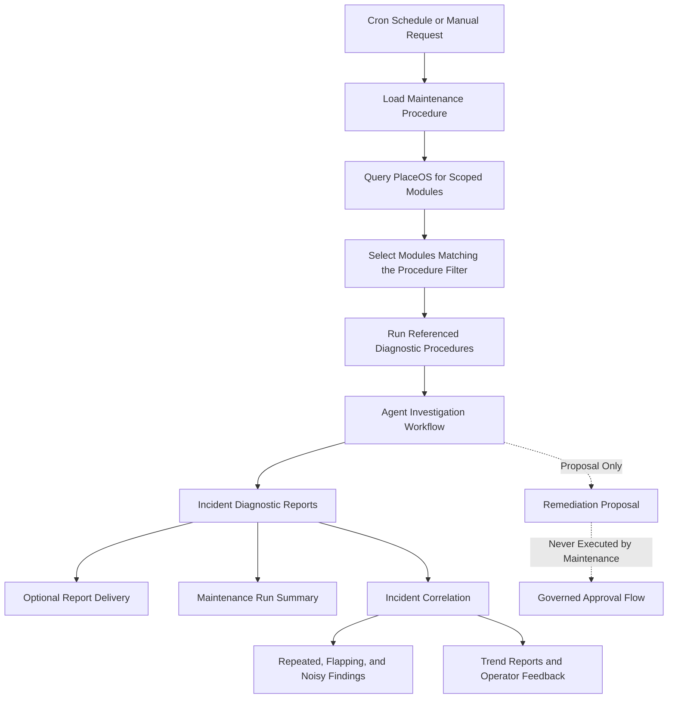

# Workflows And Procedures

For the complete application lifecycle from startup and incident triggers through investigation, bounded AI analysis, reporting, verification, and correlation, see [Application Workflow](../application-workflow.md).

The service loads repository-owned workflows and typed procedures from this directory at runtime. `PLAYBOOKS_PATH` may point to another catalogue root. Production packaging must copy the complete directory beside the service binary or set that environment variable.

An end-to-end playbook is a workflow in `workflows/`. It owns stage order, declared procedure references, transitions, and terminal outcomes. Files in `diagnostics/` are reusable diagnostic procedures; they collect evidence and produce findings, confidence, escalation need, and operator guidance. They do not define remediation, approval, or post-action verification.

```text
playbooks/
  schemas/
    workflow.v1.json
    diagnostic.v1.json
    remediation.v1.json
    verification.v1.json
    escalation.v1.json
    maintenance.v1.json
    correlation.v1.json
  remediation/
    one-procedure-per-file.yml
  verification/
    one-procedure-per-file.yml
  escalation/
    one-procedure-per-file.yml
  maintenance/
    one-procedure-per-file.yml
  correlation/
    one-policy-per-file.yml
  workflows/
    report-only.yml
  diagnostics/
    one-procedure-per-file.yml
```

## Runtime Loading

Startup is strict: an invalid workflow, procedure, reference, transition, or catalogue structure stops the service. During runtime, the catalogue fingerprints all workflow and procedure directories and atomically adopts a complete valid snapshot. An invalid live edit leaves the last-known-good workflow and procedure snapshot active and exposes the reload error through service status.

Workflows use stable `category:id@version` references instead of file paths. The current report-only runtime accepts diagnostic, remediation-proposal, report, and escalation stages. A diagnostic stage has exactly these outcomes:

- `diagnosed`, leading to remediation proposal selection or directly to a report.
- `insufficient_evidence`, leading to an escalation terminal.

A remediation stage has exactly `proposal_created` and `no_proposal`; both lead to a report terminal in the current workflow.

The workflow runner chooses only declared procedures and follows only declared transitions. AI analysis runs inside diagnostic execution and returns a typed result; it cannot invent procedures, stages, actions, or transitions.

## Adding A Diagnostic

Add one YAML file under `diagnostics/` conforming to `schemas/diagnostic.v1.json`, then explicitly reference its `diagnostic:id@version` identity from an appropriate workflow. A file that is not referenced remains inactive by design.

Each diagnostic procedure owns:

- `classification`: the stable classification written to reports and agent runs.
- `matches`: patterns plus optional source and required-context constraints.
- `steps`: ordered read-only evidence tools, dependencies, context requirements, and bounded I/O timeouts.
- `analysis`: hypotheses, confidence policy, bounded iteration, and fallback evidence tools.
- `guidance`: diagnostic summary and operator investigation steps.

The available evidence tools are code-owned capabilities. Procedures may compose existing tools without changing Crystal code. A new tool requires a reviewed Crystal implementation and schema allowlist update because tools cross the boundary from textual policy into PlaceOS access.

## Validation And Audit

Runtime loading uses strict typed YAML parsing and semantic validation. It rejects unknown fields or tools, invalid regular expressions or classifications, duplicate identities or steps, unresolved dependencies, missing context, invalid confidence or timeout bounds, broken workflow references, unknown targets, unreachable stages, and cycles.

Every investigation plan records workflow and selected procedure IDs, versions, and SHA-256 content hashes. Increment the relevant version whenever behavior changes so persisted agent runs remain explainable.

## Adding A Remediation Proposal

Add one YAML file under `remediation/` conforming to `schemas/remediation.v1.json`, then reference its `remediation:id@version` identity from a remediation workflow stage. Procedures match completed diagnostic classifications, confidence, and required scope. They may reference only an entry in the code-owned remediation action catalogue; arbitrary commands, URLs, request bodies, and executable instructions are rejected.

The remediation stage produces only `proposal_created` or `no_proposal`. Every generated proposal is approval-required and has `execution_mode: proposal_only`. Proposal generation records the remediation procedure identity and hash in the investigation plan but never invokes the referenced action.

## Adding Verification

Add one YAML file under `verification/` conforming to `schemas/verification.v1.json`. A remediation procedure must reference it by `verification:id@version`; the catalogue atomically rejects missing references.

Verification procedures compose existing read-only evidence tools with code-owned criteria. They define bounded I/O timeouts, retry intervals, attempt limits, an overall timeout, and escalation on terminal failure. Textual procedures cannot contain scripts, URLs, queries, or arbitrary expressions.

Verification does not run when a proposal is generated. It starts from `POST /api/ai-support/v1/incidents/:id/verifications` or a correlated recovery signal. Each attempt creates an independent verification-run artefact. Failed checks record the next eligible retry rather than blocking a request with sleeps. Proposal-bearing incidents are marked resolved only after their referenced verification procedure passes.

Verification runs persist through the shared PlaceOS Postgres model when database configuration is present. Database failures are exposed through service status while the in-memory run remains available.

The current workflow remains report-only. Diagnostic execution never creates a remediation proposal by itself, verification never executes the proposed action, and no workflow stage mutates PlaceOS. Approval policy and governed action execution remain separate milestones.

## Adding Escalation

Add one YAML file under `escalation/` conforming to `schemas/escalation.v1.json`, then reference it from an escalation workflow stage by `escalation:id@version`. The registry requires one unconditional fallback so every declared escalation path has an owner.

Escalation procedures match typed severity, classification, confidence, and incident age. They define only ownership queue, response SLA, priority, and required report artefacts. Delivery credentials and destinations remain service configuration. The workflow emits the closed `escalated` outcome, and the service persists a separate escalation record after report delivery so the audit includes the actual delivered, failed, or skipped outcome.

## Adding Maintenance

Add one YAML file under `maintenance/` conforming to `schemas/maintenance.v1.json`. Maintenance procedures define a validated cron schedule, named time zone, bounded module scope, deduplication window, report-delivery policy, and references to existing `diagnostic:id@version` procedures.

Maintenance files compose diagnostics; they do not copy diagnostic steps or introduce arbitrary HTTP, scripts, commands, or PlaceOS mutations. At runtime the service resolves module scope through `PlaceOS::Client`, fixes each run to the referenced diagnostic identity, and sends the resulting incident through the same report-only workflow. Run history stores the procedure identity and hash, schedule bucket, incident IDs, classification counts, timing, and errors. Manual runs are available at `POST /api/ai-support/v1/maintenance/:id/runs`, with history at `GET /api/ai-support/v1/maintenance/runs`.



## Adding Correlation Policy

Add one YAML file under `correlation/` conforming to `schemas/correlation.v1.json`. A policy declares typed grouping dimensions, bounded detector windows and thresholds, and trend-report limits. It cannot define diagnostics, queries, tools, commands, HTTP calls, or actions.

Correlation observes saved reports from reactive ingestion and scheduled maintenance after the agent workflow completes. Source-specific correlation keys remain intact for active-signal deduplication; the correlation policy groups distinct incident episodes through canonical hashed PlaceOS dimensions and classification. Findings and generated trend reports record the policy identity and content hash. Operator feedback is stored independently and never rewrites an incident report or changes a playbook automatically.
